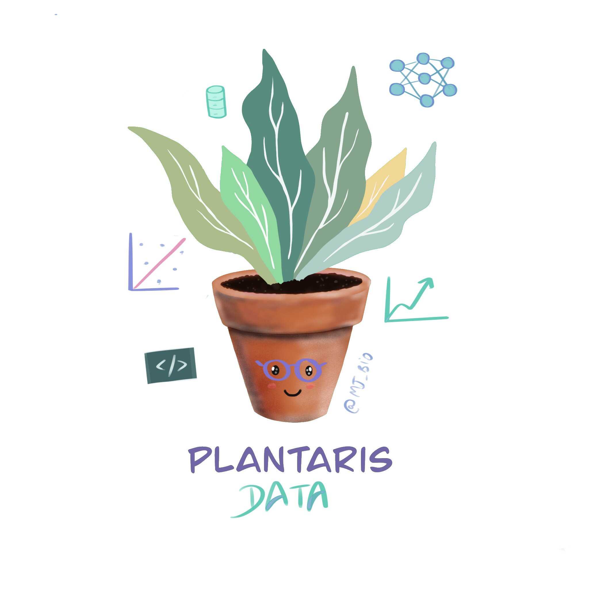

# plantaris_data
## JupyterCon 2020 - Category: Data Science Applications Talk

## **Help your plants to stay healthier with Machine Learning at home**





## Talk description
Many studies have also proven that growing indoor house plants, as long as
being a trend, improves health, despite the difficulty to keep them alive.  The
fact is that when we grow plants inside our homes, they depend 100% on us and
sometimes it is difficult to know what they need.

In this talk, we will explore how to improve your plants' lives by setting up
a basic plant monitoring system. This might sound complicated, but it is indeed
very simple and useful: thanks to using python and jupyter notebooks. Moreover,
you are going to create a machine learning pipeline from going through the
steps of data labeling, selecting the framework, the model, and you will learn
how to deal with the challenges that one can have in these processes.

Finally, you will see how this project is an excellent way to learn how to deal
with data science challenges, at the same time that you will learn plant
biology and how to implement a real-world machine learning project, and at the
same time help your plant to be happier.

## Audience
(1) This talk is beginner friendly. The main idea of this talk is to show with
a practical example how we can implement machine learning at home, at the same
time, how we can store and work with our own data for analysis.

(2) The background knowledge should be basic python knowledge. This proposal of
talk is complementary to a previous personal project called "PLANTARIS"
(https://github.com/mjmolina/plantaris).

## Project structure

```
.
├── boards
│   ├── circuit_moisture.py
│   ├── circuit_watering_simple.py
│   ├── pi_monitor.py
│   ├── requirements.txt
│   └── temp_hum.csv
└── notebooks
    ├── circuitpython_notebook.ipynb
    ├── data_analysis_sensors.ipynb
    ├── data_labeling.ipynb
    ├── prediction.ipynb
    ├── requirements.txt
    ├── temp_hum_processed.csv
    └── training.ipynb
```

### boards

This contains the scripts used to monitor the system:

| File                  | Platform       | Description                        |
| :-------------------- |:-------------- | :--------------------------------- |
| `circuit_moisture.py` | CPX+Crickit    | Needs to be called `code.py`.      |
|                       |                | Get the moisture every `60s`       |
|                       |                | so the RPI can read it.            |
| `pi_monitor.py`       | Raspberry Pi   | Listen to the CPX+Crickit system   |
|                       |                | via Serial Port. Additionally      |
|                       |                | it takes the environmental         |
|                       |                | temperature and humidity.          |
|                       |                | Generates the `temp_hum.csv` file. |

`circuit_watering_simple.py` is an example from the talk of a system,
that is in charge of watering a plant activating a relay that enables a water
pump, according to the moisture sensor values.

### notebooks

Jupyter Notebooks to perform different steps on this experiments:
* `data_labeling.ipynb`, system based on Jupyter Widgets to do an interactive
  labeling of all the photos that the system is taking.
* `prediction.ipynb`, ML prediction step, more comments can be found inside.
* `training.ipynb`, ML training step, more comments can be found inside.
* `circuitpython_notebook.ipynb`, configuration to use the CPX directly from
  a Notebook.
* `data_analysis_sensors.ipynb`, analysis of all the data gathered by the
  system.
